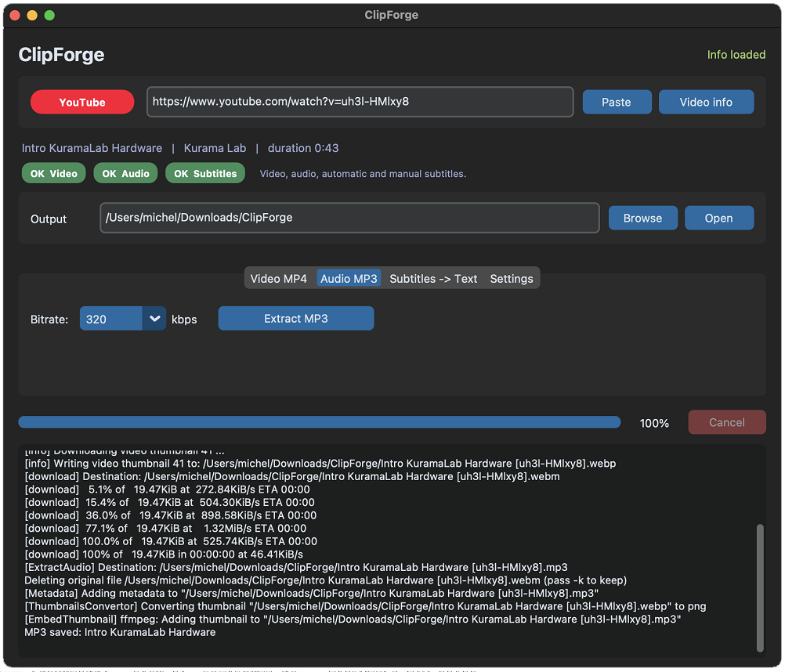
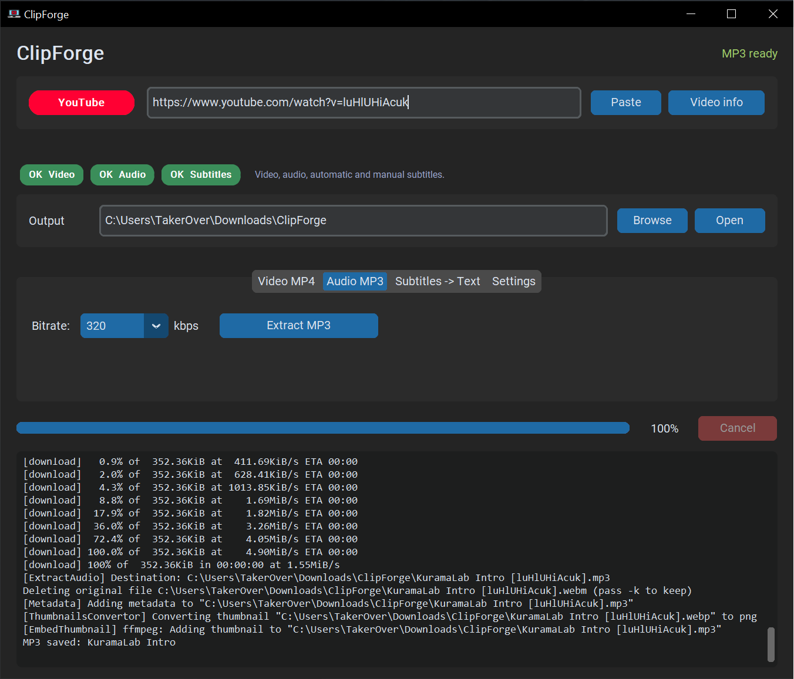

<p align="center">
  
</p>

<h1 align="center">ClipForge</h1>

[](LICENSE)
[](https://www.python.org/downloads/)
[]()
[](https://github.com/Michel-IT/ClipForge/releases/latest)
[](https://github.com/Michel-IT/ClipForge/releases)

> Desktop GUI to download videos, audio and subtitles from YouTube and 1800+ sites — for personal archival of content you have rights to.

ClipForge is a single-file Windows desktop application built on top of [`yt-dlp`](https://github.com/yt-dlp/yt-dlp) and [`CustomTkinter`](https://github.com/TomSchimansky/CustomTkinter). It auto-detects the source platform from a pasted URL, shows you which operations are available (Video / Audio / Subtitles), and runs them with one click. `ffmpeg` is bundled inside the executable — end users do not need to install anything else.

---

## ⚠️ Read this first

ClipForge is a generic downloader. It is intended **only** for content that you own, that is in the public domain, or that you have explicit permission to download. Using ClipForge to bypass DRM, scrape commercial content, or violate a platform's Terms of Service is **not** an authorized use.

The full legal terms — including the limitation of liability and the list of permitted/forbidden uses — are in [DISCLAIMER.md](DISCLAIMER.md). The same text is shown inside the application at every launch and must be explicitly accepted before the main window opens.

---

## Two builds available

ClipForge ships two parallel builds. Both wrap `yt-dlp` and have the same core feature set; pick the one whose tradeoffs you prefer.

| | **Stable (Python)** | **Preview (Tauri)** |
|---|---|---|
| **Status** | Production, daily-driver | Beta, feature-complete but less battle-tested |
| **UI** | Python + CustomTkinter | React + TypeScript + Rust (Tauri v2) |
| **Bundle** | Single `.exe` ~56 MB (PyInstaller) | Native installer ~10 MB + WebView2 (system) |
| **Languages** | English only | 46 languages auto-detected from OS |
| **Window chrome** | Native OS chrome | Custom borderless titlebar |
| **Distribution tag** | `vX.Y.Z` → [Releases](https://github.com/Michel-IT/ClipForge/releases) | `tauri-vX.Y.Z` → same Releases page |
| **CI workflow** | [`.github/workflows/release.yml`](.github/workflows/release.yml) | [`.github/workflows/release-tauri.yml`](.github/workflows/release-tauri.yml) |
| **Source folder** | repo root (`clipforge.py`) | [`tauri/`](tauri/) |

Most users want the **stable** build. The Tauri preview is for early adopters who want a smaller native installer and multilingua UI; report rough edges in [issues](https://github.com/Michel-IT/ClipForge/issues).

---

## Features

- **Auto-detects the source platform** from the pasted URL and shows a colored badge with the platform name.
- **Visual capability indicators** — three pills (Video / Audio / Subtitles) tell you at a glance what is supported for the current URL.
- **Video MP4** download with quality picker (`Auto / 1080p / 720p / 480p / 360p`), thumbnail embedded as cover art.
- **Audio MP3** extraction with bitrate picker (`128 / 192 / 256 / 320 kbps`), ID3 metadata + thumbnail embedded.
- **Subtitles → cleaned `.txt`** for sites that expose them (YouTube, Vimeo, Dailymotion). Pulls the requested languages and strips timing/markup.
- **Cookie support from your browser** (Chrome / Firefox / Edge / Brave / Opera / Vivaldi) for private or age-gated content. Auto-fallback to no-cookie if the browser is locked, with a friendly error message otherwise.
- **Single-video by default** for playlist URLs. Toggle "Download whole playlist" in Settings if you really want all of them.
- **Live progress bar** with download speed, ETA, and a Cancel button that aborts cleanly mid-download.
- **Auto-paste** at startup if the clipboard contains a recognized URL.
- **Bundled ffmpeg** — zero install for end users.
- **Single-file `.exe`** built with PyInstaller (~56 MB, no dependencies on the host).

## Supported platforms (first-class)

| Platform | Video | Audio | Subtitles |
|---|---|---|---|
| YouTube | ✓ | ✓ | ✓ |
| TikTok | ✓ (no watermark) | ✓ | — |
| Instagram | ✓ | ✓ | — |
| Facebook | ✓ | ✓ | — |
| X / Twitter | ✓ | ✓ | — |
| Vimeo | ✓ | ✓ | ✓ |
| Twitch | ✓ (VOD/clips) | ✓ | — |
| Reddit | ✓ | ✓ | — |
| Dailymotion | ✓ | ✓ | ✓ |
| SoundCloud | — | ✓ | — |
| ~1800 others | best-effort via yt-dlp generic dispatcher |

For the full list see the [yt-dlp supported sites page](https://github.com/yt-dlp/yt-dlp/blob/master/supportedsites.md).

## Screenshots

<details open>
<summary><b>macOS</b></summary>



</details>

<details>
<summary><b>Windows</b></summary>



</details>

---

## Installation

### Option A — Download the stable Python build (end users)

| Platform | Direct download | Notes |
|---|---|---|
| Windows | [⬇️ ClipForge-windows.exe](https://github.com/Michel-IT/ClipForge/releases/latest/download/ClipForge-windows.exe) | Single `.exe`, ~56 MB. Just double-click. |
| Linux | [⬇️ ClipForge-linux](https://github.com/Michel-IT/ClipForge/releases/latest/download/ClipForge-linux) | `chmod +x ClipForge-linux && ./ClipForge-linux` |
| macOS — Apple Silicon (M1/M2/M3/M4) | [⬇️ ClipForge-macos-arm64](https://github.com/Michel-IT/ClipForge/releases/latest/download/ClipForge-macos-arm64) | See macOS notes below. |
| macOS — Intel (x86_64) | [⬇️ ClipForge-macos-intel](https://github.com/Michel-IT/ClipForge/releases/latest/download/ClipForge-macos-intel) | See macOS notes below. |

All direct links always point to the **latest release**. Browse all versions on the [Releases page](https://github.com/Michel-IT/ClipForge/releases).

**Which macOS build do I need?** Open Terminal and run `uname -m` — `arm64` → use Apple Silicon, `x86_64` → use Intel. Picking the wrong one fails with `bad CPU type in executable`.

**macOS first launch (both builds).** The binary is unsigned, so Gatekeeper blocks it. Open Terminal in the download folder and run:

```bash
chmod +x ClipForge-macos-arm64        # or ClipForge-macos-intel
xattr -d com.apple.quarantine ClipForge-macos-arm64
./ClipForge-macos-arm64
```

The Finder "right-click → Open" trick only works for `.app` bundles — for raw executables like this, the Terminal commands above are the supported path.

That's it — no installer, no Python, no `ffmpeg` to set up. On first launch, accept the legal disclaimer.

> Each release is built automatically by GitHub Actions on Windows, Linux, macOS Apple Silicon (`macos-latest`) and macOS Intel (`macos-13`) the moment a `vX.Y.Z` tag is pushed. The bundled `yt-dlp` is upgraded to the latest version at build time, so every release tracks the current YouTube / TikTok / Instagram / etc. extractors.

### Option A-bis — Download the Tauri preview build

The Tauri preview is shipped under a separate tag pattern (`tauri-vX.Y.Z`) and produces native installers per platform. The current preview is **`tauri-v0.1.1`**.

| Platform | Direct download | Notes |
|---|---|---|
| Windows (MSI installer) | [⬇️ ClipForge-0.1.1-windows-x64.msi](https://github.com/Michel-IT/ClipForge/releases/download/tauri-v0.1.1/ClipForge-0.1.1-windows-x64.msi) | Standard MSI installer, ~57 MB. Requires WebView2 (preinstalled on Windows 10/11). |
| Windows (NSIS installer) | [⬇️ ClipForge-0.1.1-windows-x64-setup.exe](https://github.com/Michel-IT/ClipForge/releases/download/tauri-v0.1.1/ClipForge-0.1.1-windows-x64-setup.exe) | Smaller NSIS installer, ~46 MB, same runtime. |
| Linux (Debian/Ubuntu) | [⬇️ ClipForge-0.1.1-linux-amd64.deb](https://github.com/Michel-IT/ClipForge/releases/download/tauri-v0.1.1/ClipForge-0.1.1-linux-amd64.deb) | `sudo apt install ./ClipForge-*.deb` |
| Linux (Fedora/RHEL) | [⬇️ ClipForge-0.1.1-linux-x86_64.rpm](https://github.com/Michel-IT/ClipForge/releases/download/tauri-v0.1.1/ClipForge-0.1.1-linux-x86_64.rpm) | `sudo dnf install ./ClipForge-*.rpm` |
| Linux (AppImage) | [⬇️ ClipForge-0.1.1-linux-amd64.AppImage](https://github.com/Michel-IT/ClipForge/releases/download/tauri-v0.1.1/ClipForge-0.1.1-linux-amd64.AppImage) | `chmod +x ClipForge-*.AppImage && ./ClipForge-*.AppImage` |
| macOS — Apple Silicon | [⬇️ ClipForge-0.1.1-macos-arm64.dmg](https://github.com/Michel-IT/ClipForge/releases/download/tauri-v0.1.1/ClipForge-0.1.1-macos-arm64.dmg) | Open + drag to Applications. Unsigned, see notes above. |
| macOS — Intel | [⬇️ ClipForge-0.1.1-macos-intel.dmg](https://github.com/Michel-IT/ClipForge/releases/download/tauri-v0.1.1/ClipForge-0.1.1-macos-intel.dmg) | Built manually on an Intel Mac (`macos-13` GitHub runner pool is permanently saturated). |

[Browse all Tauri releases](https://github.com/Michel-IT/ClipForge/releases?q=tag%3Atauri).

The Tauri build adds: 46-language UI auto-detected from OS locale, custom borderless titlebar, About modal with full license attribution (yt-dlp / FFmpeg / Tauri / React), live download log panel. Trade-off: less battle-tested than the Python build, requires WebView2 on Windows.

> See [`tauri/README.md`](tauri/README.md) for build-from-source instructions for the Tauri preview.

### Option B — Build from source

Requirements:
- Python 3.10 or newer
- Git
- ~500 MB of free disk space (for `venv` + PyInstaller cache)

The build scripts always upgrade `yt-dlp` (and the other Python deps) before building, so each fresh build tracks the latest extractor changes for YouTube, TikTok, Instagram and the other supported sites.

> 📖 **Full step-by-step guide:** [docs/BUILD.md](docs/BUILD.md) — covers prerequisites for each OS, troubleshooting, and how to keep `yt-dlp` up to date.

**Windows**

```bat
git clone https://github.com/Michel-IT/ClipForge.git
cd ClipForge
scripts\build-windows.bat
```
Output: `dist\windows\ClipForge.exe`.

**Linux**

```bash
git clone https://github.com/Michel-IT/ClipForge.git
cd ClipForge
chmod +x scripts/build-linux.sh scripts/run-unix.sh
scripts/build-linux.sh
```
Output: `dist/linux/ClipForge`.

**macOS** (Apple Silicon or Intel — script auto-detects)

```bash
git clone https://github.com/Michel-IT/ClipForge.git
cd ClipForge
chmod +x scripts/build-macos.sh
scripts/build-macos.sh                 # build + auto-launch as smoke test
scripts/build-macos.sh --no-run        # build only
```
Output: `dist/macos/ClipForge-macos-arm64` or `dist/macos/ClipForge-macos-intel` (named after host arch).
The script auto-installs Homebrew + `python@3.12` + `python-tk@3.12` if missing — needed to avoid the Tcl/Tk SDK mismatch that bites python.org-installed Pythons on point-version macOS.

### Run from source without building

**Windows**: `scripts\run-windows.bat`
**Linux / macOS**: `scripts/run-unix.sh`

Both scripts create the venv on first run and `pip install --upgrade yt-dlp` on every subsequent run, so the latest extractors are picked up without rebuilding.

Manual:

```bash
python -m venv venv
# Windows:    venv\Scripts\activate
# Linux/mac:  source venv/bin/activate
pip install --upgrade -r requirements.txt
python clipforge.py
```

---

## Usage

1. Launch ClipForge and accept the legal disclaimer.
2. Paste a URL into the URL field — the platform badge and capability pills update live.
3. Pick a tab (`Video MP4`, `Audio MP3`, or `Subtitles → Text`).
4. Pick the output folder if you don't want the default (`%USERPROFILE%\Downloads\ClipForge`).
5. Hit the action button. Watch the progress bar. Use **Cancel** if you change your mind.

For private or age-gated content: open `Settings`, pick the browser whose login cookies should be used, then **close that browser** before clicking the action button (the browser holds a Windows file lock on its cookie database).

For YouTube playlists: by default ClipForge downloads only the single video that the URL points to (the `&list=...` parameter is ignored). To grab the whole playlist, tick the "Download whole playlist" checkbox in `Settings`.

---

## Project structure

```
ClipForge/
├─ .github/
│  ├─ workflows/
│  │  └─ release.yml         # GitHub Actions: builds Win/Linux/macOS on tag push, attaches to Release
│  └─ ISSUE_TEMPLATE/        # Bug report / feature request templates
├─ assets/
│  ├─ clipforge_icon4.png    # Project logo (used in README)
│  └─ icon.ico               # Application icon (window + EXE)
├─ docs/
│  ├─ BUILD.md               # Cross-platform build guide (prereqs, steps, troubleshooting)
│  └─ screenshots/           # README images
├─ scripts/
│  ├─ build-windows.bat      # Windows build (venv + PyInstaller, auto-upgrades yt-dlp)
│  ├─ build-linux.sh         # Linux build (same behaviour)
│  ├─ build-macos.sh         # macOS build (handles Tcl/Tk SDK mismatch via Homebrew Python; auto-launches as smoke test)
│  ├─ run-windows.bat        # Windows: run from source without building
│  └─ run-unix.sh            # Linux / macOS: run from source without building
├─ clipforge.py              # Single-file application (~1000 lines)
├─ clipforge.spec            # PyInstaller spec (bundles ffmpeg, yt-dlp, customtkinter, icon)
├─ requirements.txt          # Pinned runtime dependencies
├─ .gitignore
├─ .gitattributes            # Cross-platform line endings (LF for .sh, CRLF for .bat)
├─ LICENSE                   # GNU AGPL-3.0
├─ README.md                 # This file
├─ DISCLAIMER.md             # Full legal disclaimer (also shown in-app at every launch)
└─ CONTRIBUTING.md           # Contribution guidelines + CLA
```

## Tech stack

| Component | Role |
|---|---|
| [`yt-dlp`](https://github.com/yt-dlp/yt-dlp) | Extraction and download engine |
| [`CustomTkinter`](https://github.com/TomSchimansky/CustomTkinter) | Modern dark-themed Tk-based UI |
| [`imageio-ffmpeg`](https://github.com/imageio/imageio-ffmpeg) | Bundled `ffmpeg` binary |
| [`PyInstaller`](https://github.com/pyinstaller/pyinstaller) | Single-file `.exe` packager |

## Roadmap

Planned for future iterations:

- Local AI transcription via `faster-whisper` (when subtitles aren't available, e.g. TikTok or YouTube videos without captions).
- Multi-URL queue (paste several links and process in sequence).
- Playlist filters (date range, max items).
- Timestamp-based clipping (`--download-sections` to grab only minute X to Y).
- Drag & drop URLs onto the window.
- Auto-summary and translation of subtitles/text.

---

## License

ClipForge is released under the **GNU Affero General Public License v3.0** — see [LICENSE](LICENSE) for the full text.

In plain language:

- You are free to use, modify, and redistribute ClipForge.
- If you distribute a modified version, or run a modified version as a network service, you must publish the source code of your modifications under the AGPL-3.0 as well.
- The bundled `ffmpeg` binary may include components under (L)GPL — AGPL-3.0 is compatible with these.
- The author retains the copyright and may release future versions under additional licenses (dual licensing). Contributions are accepted only under the terms of the [Contributor License Agreement](CONTRIBUTING.md#contributor-license-agreement).

This is not legal advice — read [LICENSE](LICENSE) and [DISCLAIMER.md](DISCLAIMER.md) for the binding terms.

## Contributing

Issues and pull requests are welcome. Before submitting a PR please read [CONTRIBUTING.md](CONTRIBUTING.md) — non-trivial contributions require signing a short Contributor License Agreement.

## Author

**Michel-IT** — [github.com/Michel-IT](https://github.com/Michel-IT)
